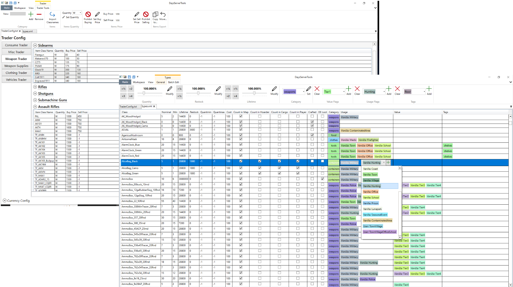

# DayzServerTools

DayzServerTools are designed to simplify and speed up the setup of your custom DayZ Server.

**[Download](https://github.com/rvost/DayzServerTools/releases/latest)**
---

## Features

### DayZ types.xml editor

* Edit `types.xml` files:
	* Add/Remove items;
	* Edit multiple items at once;
	* Change quantity/restock/lifetime of items in percentage;
	* Move items to new file (better way to override vanilla `types.xml`);
	* Batch editing.
* User definitions (`cfglimitsdefinitionuser.xml`) and different styles of writing `types.xml` are supported.
* Load `cfglimitsdefinition.xml` (and `cfglimitsdefinitionuser.xml`) to select from avilable flag values.
* Validate `types.xml` according to `cfglimitsdefinition.xml` and `cfglimitsdefinitionuser.xml`.
* Export items to `cfgspawnabletypes.xml`, random presets or trader config.
* Import items from list of classnames in free form.

### DayZ cfgspawnabletypes.xml editor

* Add/Remove items.
* Add/Remove item cargo or attachments.
* Edit amount of damage dealt to the item upon spawning.
* Edit chance of attachments appearing on an item.
* Load `cfgrandompresets.xml` to select from avilable cargo or attacments presets.
* Validate `cfgspawnabletypes.xml` according to `cfgrandompresets.xml`.
* Import items from list of classnames in free form.

### Dayz Trader config editor

DayzServerTools supports [Dr_J0nes Trader Mod](https://steamcommunity.com/sharedfiles/filedetails/?id=1590841260&) configs:

* Rename Traders
* Add(remove) new categories to traders.
* Add(remove) items.
* Batch edit items. 
* Export items from `types.xml` to `TraderConfig.txt`.
* Import items from list of classnames in free form.
* Validate config.

### Random presets editor

* Add/Remove presets
* Import items from `types.xml`
* Import items from list of classnames in free form.

### User flags editor

You can edit `cfglimitsdefinitionuser.xml` too. Add/Remove flags, change names and compositions of existing flags.
Validate your custom flags according to `cfglimitsdefinition.xml`.

### Generic features

* Tabbed interface: open multiple files side-by-side, e.g. open your server `TraderConfig` and provided by mod then quickly export the items from the mod to your trader.
* Tooltips for explaining the purpose of fields.

## Installation

Go to latest [release](https://github.com/rvost/DayzServerTools/releases/latest) page and download DayzServerToolsSetup.exe file to install app.
Your installation of DayzServerTools will be automatically updated as new releases become available.

## How to

Some tips on how to use DayzServerTools:

* Quantity, Restock, Lifetime and Category modification in Types tools works on selected (*use Ctrl+A to select all*) items.
* Export items from `types.xml` to trader or new file works on on selected too.
* To move items from one trader to another: use  right click on selected items and choose option in context menu.
* To delete value or usage flag or tag: right click on it and choose 'Remove' in context menu.
* Delete rows in tables with `Del` key. 

## Known issues

**Caution:** DayzServerTools uses generic format for xml files the order of tags and attributes matches the one in vanilla files, comments and your custom formatting will be stripped on editing.

This may cause merge conflicts with future versions of the files (if you edited `db\types.xml` for example).
Workaround: when update comes out, you can open&save new file with the tool and then merge your current version with it.